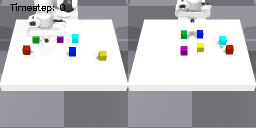
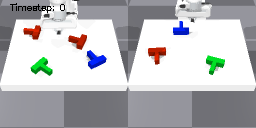
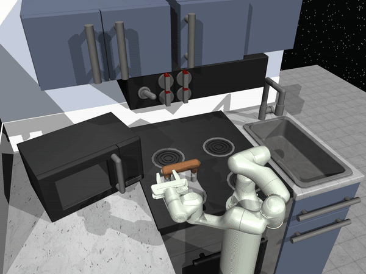

# EC-Diffuser: Multi-Object Manipulation via Entity-Centric Behavior Generation

Official PyTorch code release for the ICLR 2025 paper:

> **EC-Diffuser: Multi-Object Manipulation via Entity-Centric Behavior Generation**  
> *Carl Qi, Dan Haramati, Tal Daniel, Aviv Tamar, and Amy Zhang*  
> [Project Website](https://sites.google.com/view/ec-diffuser) • [arXiv](https://www.arxiv.org/abs/2412.18907) • [OpenReview](https://openreview.net/forum?id=o3pJU5QCtv)

<p align="center">
   &nbsp;&nbsp;
   &nbsp;&nbsp;
  
</p>

---

## Table of Contents

- [Overview](#overview)
- [Installation](#installation)
- [Downloading Datasets](#downloading-datasets)
- [Evaluating a Pretrained Agent](#evaluating-a-pretrained-agent)
- [Training an Agent](#training-an-agent)
- [Citation](#citation)

---

## Overview

This repository contains the official PyTorch implementation of **EC-Diffuser**, a novel behavioral cloning (BC) approach that leverages object-centric representations and an entity-centric Transformer with diffusion-based optimization, enabling efficient learning from offline image data. For more details, please refer to the [project website](https://sites.google.com/view/ec-diffuser) and the associated paper.

---

## Installation

Follow these steps to set up the environment:

1. **Create and activate a Conda environment** (we tested on Python 3.8):

    ```bash
    conda create -n dlp python=3.8
    conda activate dlp
    ```

2. **Install main dependencies:**

    The key libraries are:

    | Library             | Version |
    |---------------------|---------|
    | `torch`             | `2.1.2` |
    | `stable-baselines3` | `1.5.0` |
    | `isaacgym`          | (as required) |

    For a complete list, please see [requirements.txt](requirements.txt).

3. **Install Diffuser-related packages:**

    ```bash
    cd diffuser
    pip install -e .
    cd ../
    ```

4. **(Optional) Setup for the FrankaKitchen environment:**

    - Install [MuJoCo](https://github.com/deepmind/mujoco). (Refer to the official instructions for installation and licensing.)
    - Install D4RL by cloning the repository:

      ```bash
      git clone https://github.com/Farama-Foundation/d4rl.git
      cd d4rl
      pip install -e .
      cd ../
      ```

5. **Finalize environment setup:**

    Run the provided setup script:

    ```bash
    bash setup_env.sh
    ```

    *(If the script requires sourcing, you can also run: `source setup_env.sh`)*

---

## Downloading Datasets

Download the required datasets, pretrained agents, and DLP representations from our [HuggingFace dataset](https://huggingface.co/datasets/carlq/ecdiffuser-data):

```bash
git lfs install
git clone https://huggingface.co/datasets/carlq/ecdiffuser-data
```

## Evaluating a Pretrained Agent

You can evaluate the pretrained agents with the following commands. Replace `CUDA_VISIBLE_DEVICES=0,1` with the GPU devices you wish to use (Note IsaacGym env has to reside on GPU 0).

- **PushCube Agent:**

    ```bash
    CUDA_VISIBLE_DEVICES=0,1 python diffuser/scripts/eval_agent.py --config config.plan_pandapush_pint --num_entity 3 --planning_only
    ```

- **PushT Agent:**

    ```bash
    CUDA_VISIBLE_DEVICES=0,1 python diffuser/scripts/eval_agent.py --config config.plan_pandapush_pint --push_t --num_entity 3 --push_t_num_color 1 --planning_only
    ```

- **FrankaKitchen Agent:**

    ```bash
    CUDA_VISIBLE_DEVICES=0,1 python diffuser/scripts/eval_agent.py --config config.plan_pandapush_pint --kitchen --planning_only
    ```

---

## Training an Agent

Train your own agents using the commands below. Replace `CUDA_VISIBLE_DEVICES=0,1` with the GPU devices you wish to use (Note IsaacGym env has to reside on GPU 0).

- **Train a PushCube Agent (3 cubes):**

    ```bash
    CUDA_VISIBLE_DEVICES=0,1 python diffuser/scripts/train.py --config config.pandapush_pint --num_entity 3
    ```

- **Train a PushT Agent (1 T-shaped object):**

    ```bash
    CUDA_VISIBLE_DEVICES=0,1 python diffuser/scripts/train.py --config config.pandapush_pint --push_t --num_entity 1
    ```

- **Train a FrankaKitchen Agent:**

    ```bash
    CUDA_VISIBLE_DEVICES=0,1 python diffuser/scripts/train_kitchen.py --config config.pandapush_pint --kitchen
    ```

---

## Citation

If you find our work useful, please consider citing:

>Carl Qi, Dan Haramati, Tal Daniel, Aviv Tamar, and Amy Zhang. "EC-Diffuser: Multi-Object Manipulation via Entity-Centric Behavior Generation." Proceedings of the Twelfth International Conference on Learning Representations (ICLR). 2025.

```bibtex
@inproceedings{
    qi2025ecdiffuser,
    title={{EC}-Diffuser: Multi-Object Manipulation via Entity-Centric Behavior Generation},
    author={Carl Qi and Dan Haramati and Tal Daniel and Aviv Tamar and Amy Zhang},
    booktitle={The Thirteenth International Conference on Learning Representations},
    year={2025},
    url={https://openreview.net/forum?id=o3pJU5QCtv}
    }
```